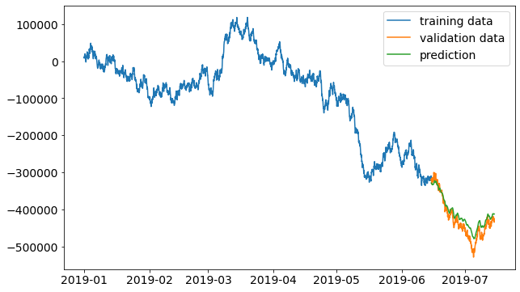
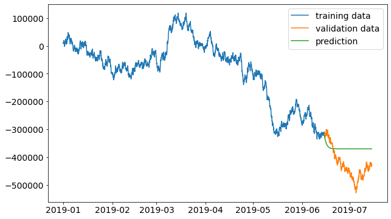

# Time Series Challenge

This repository contains a solution to a Time Series Challenge I submitted during an interview process for a Data Scientist role.

The assignment had to be done in Jupyter Notebook format and completed in 48 hours.

## Challenge

Provide one month out forecasts for three time series variables provided in the [CSV file](data/timeseries).

## Interpretation, approach and assumtions

The three variables provided in the dataset are forecasted independently since they have different frequencies and patters, and no correlation between them has been found.

The three variables are named varA, varB and varC, and are modelled using different approaches:

- **varA**: the series has a 5 minutes frequency and contains gaps. The series has records at the end of the month (from the 25th until the end of the month), for the rest of the days it contains 0's. This series is going to be modelled using Prophet since it handles well gapped data.
- **varB**: the series contains outliers at the end of the history period. Frequency is 10 minutes. Seasonality patterns are strong. This one is going to be modelled with Prophet also.
- **varC**: This series doesn't show a clear seasonality pattern. It has some short-term trend. Interesting to include a memory capability, so I will choose an LSTM Network o model it.

 

    

 

For more details go to the [notebook](notebooks/Time%20Series%20Challenge.ipynb)

## Results

Each of the three variables present different characteristics and require different processing and modelling approach.

[Prophet](https://facebook.github.io/prophet/) is chosen to model more stable time series with clear patterns and where data present gaps, missing values or shorter sequences (**varA** and **varB**).

LSTM is chosen to extract patterns from time series when those are not clear enough and also to include a memory component and avoid just extrapolating the trend (**varC**).

### Forecasting varA and varB with Prophet

For forecasting **varA** and **varB**, I've created a function to train a Prophet model from fbprophet library with optimized parameters. To do so, I've used ParameterGrid from sklearn.model_selection to define the grid of parameters and then cross_validation from fbprophet.diagnostics in order to calculate the error for each combination of parameters in the history series.

The forecast result for **varA** looks like expected based on the interpretation of the data. The method is making predictions for the last days of July:
 

    

 

The forecast for **varB** captures well the seasonality pattern and also catches the change point around June 2019 where looks like the trend changes:

 

    

 

### Forecasting varC with an LSTM Network using Keras

The forecast for **varC** is done building an LSTM Network composed by two layers of 20 and 50 neurons with a Dropout to avoid overfitting. The model is built with 2 simple hidden stacked layers since I was not able to access to enough computational power to build a more complex network.

Firstly, I'm doing a simple step forecast on validation data using the trained model. The predictions are made using a window of true values. After each prediction, the window moves forward one step into the true values.

 

    

 

Secondly, I'm doing a multi step forecast on validation data using the trained model since it is required to make a 30-days out forecast. Using a window of 60 days I'm predicting the next 30 values. To do so, the window makes one prediction and then moves one step forward and insted of considering the following true data point, is considering the prediction made on the previous step. So the further we predict into the future, the more we are predicting on top of predictions, so the accuracy goes down. Increasing the window used to predict future values we would increase the accuracy, however it is more computationally costly.

The MAPE of the multi-step prediction on the validation set is 16,17%:

 

    

 

Finally, I'm performing a multi step prediction to predict the following 30 days into the future using a 60 days window.

 

    

 

