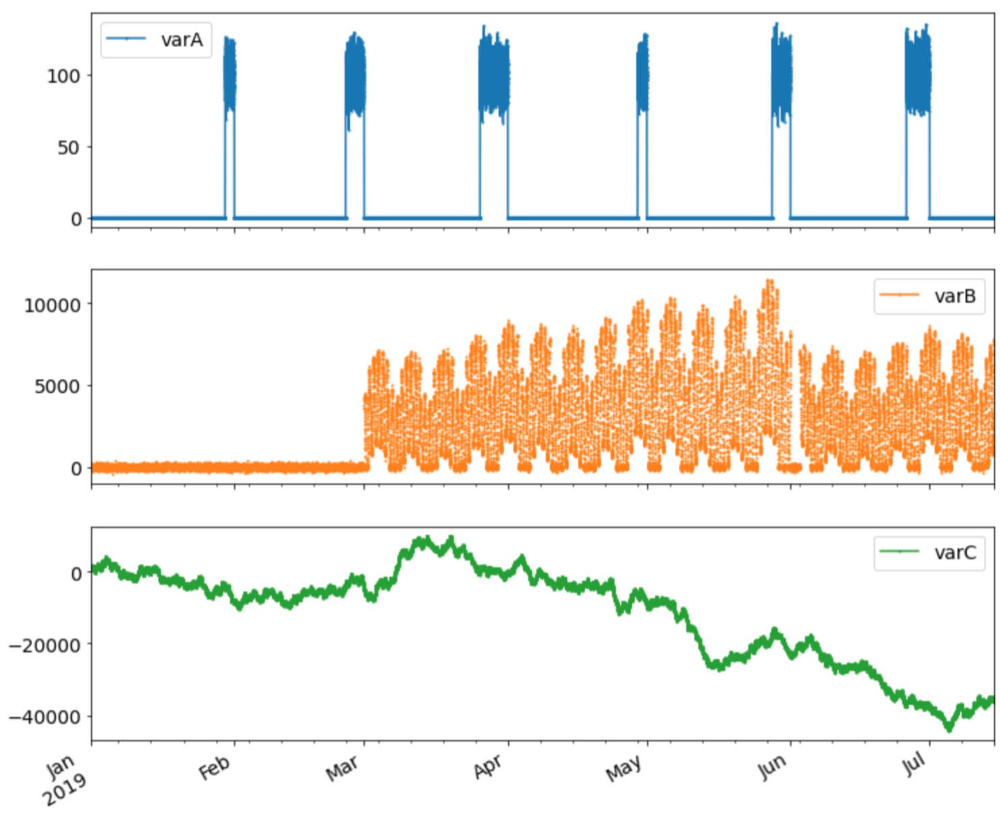
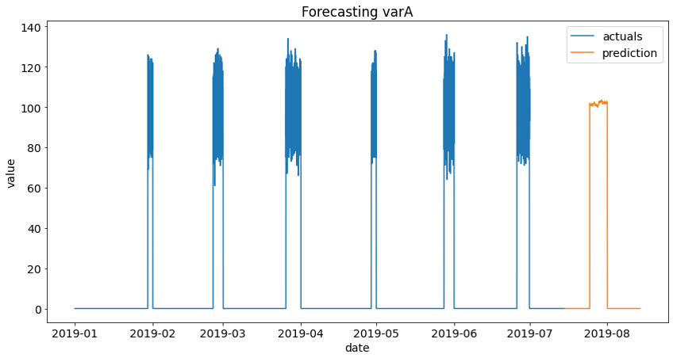
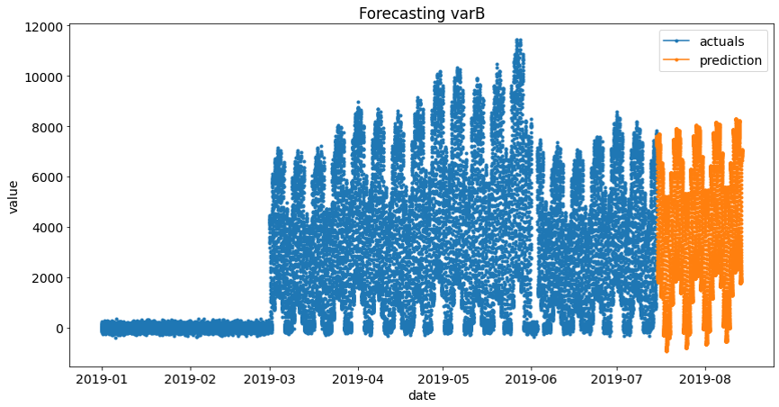
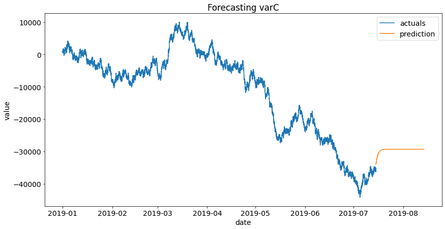

# Time Series Challenge

This repository contains a solution to a Time Series Challenge I submitted during an interview process for a Data Scientist role.

The assignment had to be done in Jupyter Notebook format and completed in 48 hours.

## Challenge

Provide one month out forecasts for three time series variables provided in the [CSV file](data/timeseries).

## Interpretation, approach and assumtions

The three variables provided in the dataset are forecasted independently since they have different frequencies and patters, and no correlation between them has been found.

The three variables are named varA, varB and varC, and are modelled using different approaches:

- **varA**: the series has a 5 minutes frequency and contains gaps. The series has records at the end of the month (from the 25th until the end of the month), for the rest of the days it contains 0's. This series is going to be modelled using Prophet since it handles well gapped data.
- **varB**: the series contains outliers at the end of the history period. Frequency is 10 minutes. Seasonality patterns are strong. This one is going to be modelled with Prophet also.
- **varC**: This series doesn't show a clear seasonality pattern. It has some short-term trend. Interesting to include a memory capability, so I will choose an LSTM to model it.

 

    

 

For more details go to the [notebook](notebooks/Time%20Series%20Challenge.ipynb)

## Results

 

    

 

 

    

 

 

    

 